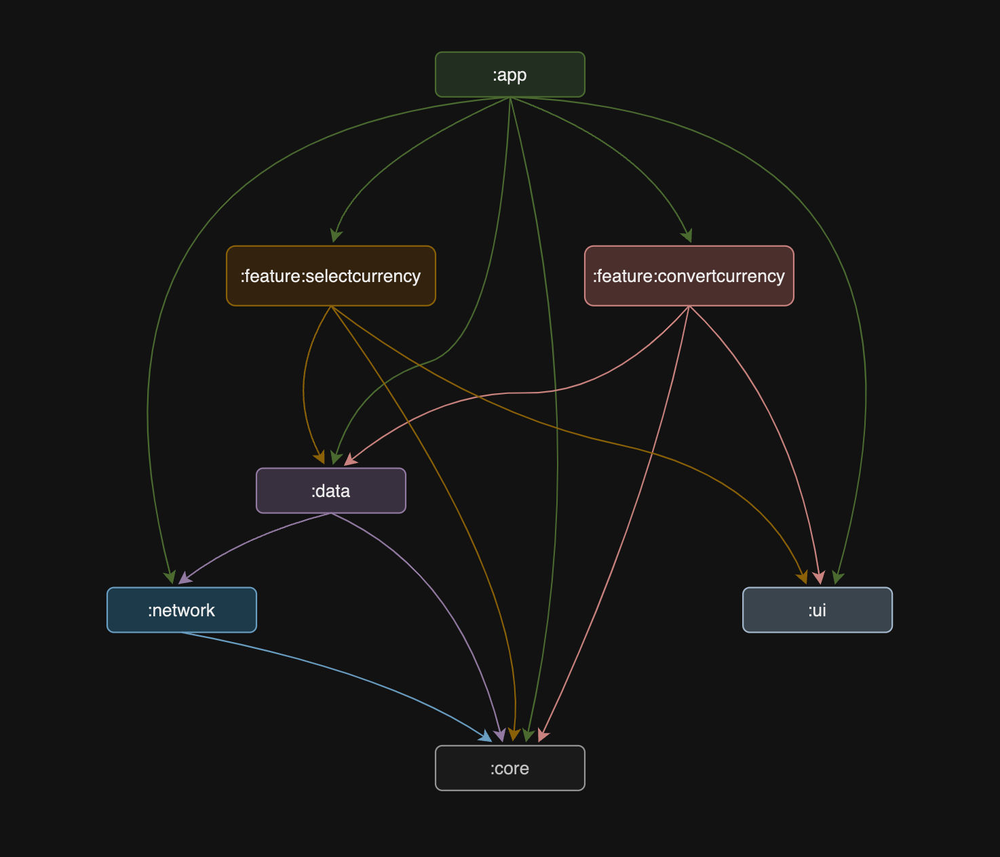
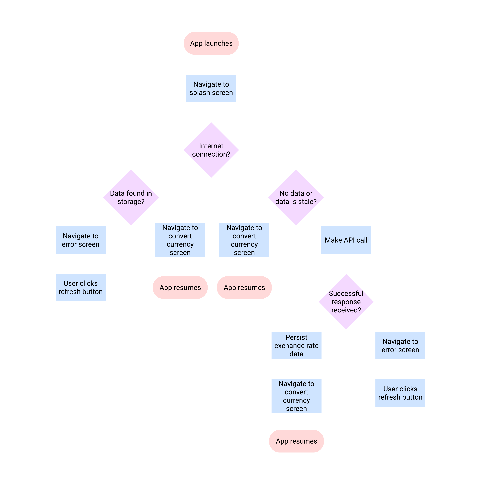

## Overview
Currency conversion Android app using live exchange rates.

## Installation

## Demo

  
  

## Architecture

## Modularization

## App Launch Flowchart

## Built With
- [Compose](https://developer.android.com/develop/ui/compose) - Android’s modern toolkit for building native UI with a declarative approach.
- [Kotlin Coroutines](https://developer.android.com/kotlin/coroutines) - Simplify asynchronous programming by allowing you to write concurrent code that is more readable and maintainable.
- [DataStore](https://developer.android.com/topic/libraries/architecture/datastore) - A data storage solution that allows you to store key-value pairs or typed objects with built-in support for Kotlin coroutines and Flow.
- [Hilt](https://developer.android.com/training/dependency-injection/hilt-android) - A dependency injection library for Android that reduces the boilerplate of doing manual dependency injection in your project.
- [Junit5](https://junit.org/junit5/) - A testing framework for Java and Kotlin that provides powerful tools for writing and running tests.
- [Kotest](https://kotest.io/) - A flexible and comprehensive testing library for Kotlin, offering a range of testing styles and extensive assertion capabilities.
- [Ktor](https://ktor.io/) - An asynchronous framework for creating microservices and web applications in Kotlin, designed to be lightweight and highly extensible.
- [Material3](https://m3.material.io/develop/android/jetpack-compose) - A design system that provides a set of principles and components for creating modern, adaptive UIs in Jetpack Compose.
- [Navigation](https://developer.android.com/guide/navigation) - Simplifies implementing navigation, including handling fragment transactions, deep linking, and providing a consistent user experience.
- [Reorderable](https://github.com/Calvin-LL/Reorderable) - A Jetpack Compose library that allows you to create reorderable lists and grids with drag-and-drop functionality.
- [Room](https://developer.android.com/jetpack/androidx/releases/room) - A persistence library that provides an abstraction layer over SQLite to allow for more robust database access while harnessing the full power of SQLite.
- [Tap Target Compose](https://github.com/PierfrancescoSoffritti/tap-target-compose) - A Jetpack Compose library that helps you guide users by highlighting specific UI elements with customizable tap targets.
